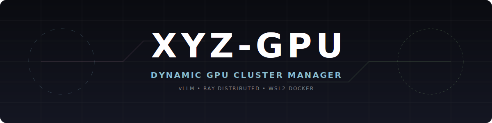
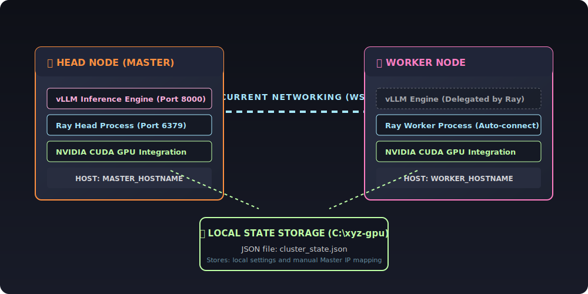
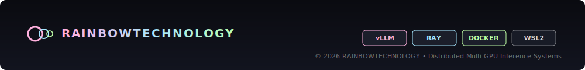

# 🌌 XYZ-GPU: Orquestador Dinámico de Clúster de GPU con vLLM + Ray

Este repositorio permite levantar y gestionar de forma dinámica un clúster distribuido de inferencia de IA utilizando **vLLM** y **Ray** dentro de contenedores Docker (WSL2), ejecutándose de forma local en cada máquina (ej. en `C:\xyz-gpu`) y sincronizándose a través de la introducción de la dirección IP local de red del nodo Master.

---

## 🏗️ Características Principales

1. **Gestión de Estado Local (`cluster_state.json`)**: Cada equipo gestiona su estado y configuración localmente dentro de su propia carpeta local (`C:\xyz-gpu`).
2. **Sincronización por IP Manual**: El script de control interactivo permite configurar la IP local de red del nodo Master directamente desde los ajustes, permitiendo que las dos máquinas se sincronicen e interactúen sin necesidad de un disco de red compartido.
3. **Archivos de Entorno Individuales**: Generación de archivos `.env.NOMBRE-EQUIPO` basados en el nombre de host de cada ordenador para evitar conflictos de configuración.
4. **Cero Dependencias en Host**: Inferencia y dependencias empaquetadas totalmente dentro del contenedor oficial de vLLM, sin necesidad de entornos virtuales ni gestores adicionales en la máquina host.

---

## 🗺️ Arquitectura del Sistema Distributed Ray / vLLM



---

## 🛠️ Requisitos Previos (En ambos PCs)

1. **WSL2 y Ubuntu** instalado en Windows.
2. **Drivers oficiales de NVIDIA** instalados en Windows.
3. **Docker Desktop** instalado con soporte para WSL2 activado (*Settings -> Resources -> WSL Integration*).
4. Configuración de **Red en Modo Espejo** (`mirrored`) en WSL2.
   * Crea un archivo `C:\Users\TuUsuario\.wslconfig` con:
     ```ini
     [wsl2]
     networkingMode=mirrored
     ```
   * Ejecuta `wsl --shutdown` en la terminal de Windows para aplicar el cambio.

---

## 🚀 Guía de Uso Rápido

1. **Clonar/Descargar este repositorio** en la carpeta **`C:\xyz-gpu`** en ambos PCs.
2. Ejecutar **`installer.bat`** en cualquiera de las dos máquinas.

### Flujo de Trabajo Normal:

#### 1. Iniciar el Clúster
* **En el PC Master (Torre):** 
  1. Ejecuta `installer.bat`.
  2. Si no es el Master por defecto, ve a `[1] Ajustes / Settings` -> `[1] Forzar y Migrar: Establecer ESTE equipo como MASTER`.
  3. Regresa al menú principal y selecciona `[2] Desplegar / Iniciar Clúster`. Esto levantará el nodo principal de Ray y el servidor vLLM.
* **En el PC Worker (Portátil):** 
  1. Ejecuta `installer.bat`.
  2. Ve a `[1] Ajustes / Settings` -> `[4] Configurar IP del Master Manualmente (Sin ruta compartida)`.
  3. Introduce la IP local de la Torre (puedes ver la IP de la Torre en su cabecera del script de control).
  4. Regresa al menú principal y selecciona `[2] Desplegar / Iniciar Clúster`. Se conectará automáticamente al Master y sumará su GPU al clúster.

#### 2. Cambiar de Master Dinámicamente
* Si deseas que el Portátil (PC 2) pase a ser el Master, abre el gestor interactivo en el portátil y presiona la opción **`[1] Ajustes / Settings -> [1] Forzar y Migrar`**.
* Al iniciar los contenedores (opción `[2]`), el portátil iniciará el servidor vLLM.
* En la Torre (PC 1), ve a `[1] Ajustes / Settings -> [4] Configurar IP del Master Manualmente` e introduce la IP del portátil para que actúe como Worker de este.

#### 3. Limpieza y Apagado
* Utiliza la opción **`[2] Apagar / Liberar GPUs`** en cualquiera de las máquinas para apagar los contenedores y liberar la VRAM al instante.

---

## 💻 Despliegue en un Segundo Equipo (Nuevo Portátil)

Si quieres instalar este orquestador en un nuevo portátil para sumarlo al clúster, sigue estos pasos:
1. **Descarga o clona la carpeta del proyecto** en la ruta local `C:\xyz-gpu` de la nueva máquina.
2. **Prepara el entorno**: Asegúrate de tener instalado Docker Desktop (con integración WSL2) y configura la red en modo espejo (`mirrored`) en el archivo `.wslconfig` (ver la sección de *Requisitos Previos*).
3. **Ejecuta `installer.bat`** en el nuevo portátil. El script detectará el idioma de su sistema automáticamente.
4. **Vincular como Worker**:
   * Entra en `[1] Ajustes / Settings` -> `[4] Configurar IP del Master Manualmente (Sin ruta compartida)`.
   * Introduce la dirección IP del equipo Master (puedes ver la IP de la máquina Master en la parte superior de la pantalla del script en dicho equipo).
   * Vuelve al menú principal e inicia el clúster con la opción `[2]`. Se conectará y sumará su potencia.

---




